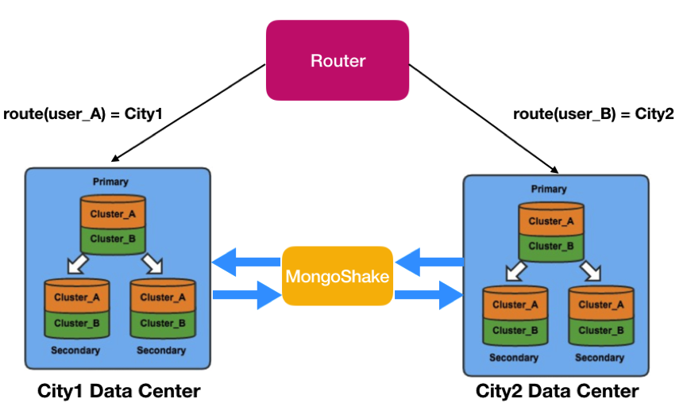

# Setup MongoDB replica set, syncing with mongoshake

Một số nội dung về MongoDB, gồm:

- [Deploying Replica set MongoDB](docs/replica-set-mongodb.md)

- [Deploying sync data through data centers with Mongo-Shake](docs/mongoshake.md)

