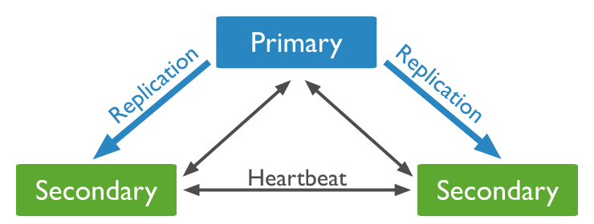

# Table of content

- [1. Giới thiệu MongoDB Replication](#mongodb-replication)
  - [1.1 Về Replica set](#replica-set)
  - [1.2 Reference read](#reference-read)
- [2. Deploy Replica set](#deploy-replica-set)
  - [2.1 Cài đặt MongoDB 3](#install-mongodb)
  - [2.2 Replica set mà không access control](#Deploy-replica-set-no-access-control)
  - [2.3 Replica set MongoDB với access control](#Deploy-replica-set-access-control)

# Content

## <a name="mongodb-replication">1. Giới thiệu MongoDB Replication</a>

### <a name="replica-set">1.1 Về Replica set</a>

Replica set MongoDB là một nhóm các tiến trình mongod mà duy trì cùng tập dữ liệu. Replica set được sử dụng cho cho dự phòng, high available MongoDB.
Một Replica set gồm nhiều MongoDB Servers chứa dữ liệu ( gồm 01 Primary và một hoặc nhiều Secondary) và một tùy chọn MongoDB server sử dụng làm Arbiter.
Trong Replica set thì chỉ Primary được quyền write. Primary sẽ ghi lại các tất cả hoạt động thay đổi vào tập dữ liệu của nó trong oplog (operation log). Các Secondary sẽ thực hiện sao chép và áp dụng những hoạt động này lên tập dữ liệu của chúng trong một tiến trình bất đồng bộ.

<p align="center">

</p>

Trong mô hình Replica set trên, khi Primary không có sẵn, thì các Secondary nắm một phiếu bầu để chọn nó làm Primary mới. Tuy nhiên việc quyết định thành viên Secondary nào lên Primary mới còn phụ thuộc vào giá trị priority.

Trong Replica set khi số lượng các members là chẵn, chúng ta sẽ thêm một thành viên làm Arbiter để thực hiện tham gia vào việc chọn Secondary thành Primary.

<p align="center">

</p>

– Arbiter chỉ có chức năng vote, không lưu trữ dữ liệu trong replica set, cũng như không thể thành chức năng của thành viên khác trong replica set

– Arbiter yêu cầu cấu hình tối thiểu để cài đặt mongodb, do đó chúng ta có thể tận dụng một server nào nó trong hệ thống như monitor, application hoặc thậm chí tạo một instance mongod khác ở một trong các member của replica set. 

### <a name="reference-read">1.2 Reference read</a>

Trong MongoDB replication thì chỉ có 01 máy chủ ( Primary) được quyền write, và tất cả các máy chủ trong replica set đều có thể thực hiện thao tác read. Reference read trong Mongodb có 05 chế độ :

- primary: Là chế độ read mặc định, mà tất cả thao tác read đến primary

- primaryPreferred: Tất cả yêu cầu read đều từ primary, nhưng primary unvailable thì nó sẽ chuyển hướng read sang secondary

- secondary: Tất cả yêu cầu read đến secondary

- secondaryPreferred: Tất cả yêu cầu read đều từ secondary, nhưng secondary unvailable thì nó sẽ chuyển hướng read sang primary

- nearest: Yêu cầu read từ replica set members mà có least network latency (độ trễ thấp nhất, không phân biệt primary và secondary)

## <a name="Deploy-replica-set">2. Deploy Replica set</a>

Mô hình triển khai replica set MongoDB với 01 primary, 01 secondary và tận dụng 01 server trong hệ thống làm Arbiter cho việc vote

<p align="center">

</p>

### <a name="install-mongodb">2.1 Cài đặt MongoDB 3</a>

Thực hiện cài đặt MongoDB 3 trên 03 máy chủ CentOS 7

**Step1: Tạo mongodb3 repository**

```
cat >/etc/yum.repos.d/mongo.repo<<EOF
[mongodb-org-3.4]
name=MongoDB Repository
baseurl=https://repo.mongodb.org/yum/redhat/\$releasever/mongodb-org/3.4/x86_64/
gpgcheck=1
enabled=1
gpgkey=https://www.mongodb.org/static/pgp/server-3.4.asc
EOF
```

**Step2: Cài đặt MongoDB và các gói công cụ**

```
yum install -y mongodb-org
systemctl start mongodb
systemctl enable mongodb
```

**Step3: Cho phép truy cập mongodb từ một số IP Address**

Sửa tệp cấu hình /etc/mongod.conf trên các server

`sed -i 's/127.0.0.1/0.0.0.0/' /etc/mongod.conf`

Cho phép truy cập mongodb từ local network

```
firewall-cmd --permanent --zone=public --add-rich-rule='rule family="ipv4" source address="192.168.10.0/24" port port="27017" protocol="tcp" accept'
firewall-cmd --reload
```

### <a name="Deploy-replica-set-no-access-control">2.2 Replica set mà không access control</a>

**Step1: Enable replication on MongoDB**

Trên 03 server mà cài đặt MongoDB, thêm nội dung sau vào tệp tin cấu hình mongod.conf để enable replication với tên replica set id là **mongo_rep**

```
cat >>/etc/mongod.conf <<EOF
replication:
    #replica set id
    replSetName: mongo_rep
EOF
```

Thực hiện restart mongod để chuyển qua chế độ replication

`systemctl restart mongod`

**Step2: Thiết lập hosts.conf trên 03 servers**

```
cat >>/etc/hosts <<EOF
192.168.10.111    mongo01
192.168.10.112    mongo02
192.168.10.113    mongo03
EOF
```

**Step3: Khởi tạo Replica set trên Primary**

Với replica set MongoDB, member nào có priority cao hơn sẽ là primary. Do đó khi cấu hình chúng ta sẽ để server mongo01 có priority cao hơn để làm default primary.

Cấu hình replica set trên primary (mongo01)

```
[root@mongo01]# mongo
MongoDB shell version v3.4.13
connecting to: mongodb://127.0.0.1:27017
>rs.initiate( { _id: "mongo_rep", members: [ { _id: 0, host: "mongo01:27017", priority: 2 } ] } )
>rs.add( { _id:1,host:"mongo02:27017",priority:1 } )
>rs.addArb("mongo03:27017")
```

### <a name="Deploy-replica-set-access-control">2.3 Replica set MongoDB với access control</a>

MongoDB cho phép chứng thực giữa các members của replica set with 2 phương thức:

– KeyFile

– x.509

Chúng ta thực hiện chứng thực với keyFile. Nội dung của keyFile giống như chia sẻ mật khẩu chung giữa các member servers

**Step1: Trên primary MongoDB server**

Tạo keyFile

```
mkdir -p /mongodb/data #Thư mục chứ keyFile
echo "sharedpassword" >/mongodb/data/keyfile
chown -R mongod:mongod /mongodb
chmod 400 /mongodb/data/keyfile
```

**Step2: Enable chứng thực trên all member replica set**

Để enable chứng thực chúng ta thêm đoạn sau vào tệp cấu hình mongodb

```
cat >>/etc/mongod.conf <<EOF
security:
    authorization: enabled #Enable chứng thực password
    keyFile: /mongodb/data/keyfile #keyFile path
EOF
```

**Step3: Tạo tài khoản chứng thực**

Cách tạo tài khoản tham khảo qua [https://docs.mongodb.com/manual/tutorial/create-users/](https://docs.mongodb.com/manual/tutorial/create-users/)

Ví dụ tạo tài khoản có quyền root (mức cao nhất)

```
mongo
>use admin
>db.createUser(
  {
    user: "keepwalking",
    pwd: "P@ssw0rd",
    roles: [
    "root"
    ]
  }
)
```

**Step4: Copy keyfile đến các MongoDB server khác**

Ở đây chúng ta sẽ copy keyFile sang secondary và Arbiter member, sử dụng rsync để không phải tạo lại đường dẫn và quyền cho keyFile.

rsync -avzhP /mongodb root@192.168.10.112:/
rsync -avzhP /mongodb root@192.168.10.113:/

**Step5: Copy mongod.conf đến các MongoDB server khác**

Để đồng bộ thông tin cấu hình MongoDB thì chúng ta cũng sử dụng rsync để copy mongod.conf đến các member của replica set

rsync -avzhP /etc/mongod.conf root@192.168.10.112:/etc/
rsync -avzhP /etc/mongod.conf root@192.168.10.113:/etc/

**Step6: Restart mongod từ các replica set servers**

`systemctl restart mongod`

**Step7: Kiểm tra Replication MongoDB**

```
[root@mongo01 ~]# mongo -u keepwalking -p P@ssw0rd admin
mongo_rep:PRIMARY>
[root@mongo02 ~]# mongo -u keepwalking -p P@ssw0rd admin
mongo_rep:SECONDARY>
[root@server03 ~]# mongo
mongo_rep:ARBITER> rs.slaveOk();
mongo_rep:ARBITER> show dbs;
local  0.000GB
```

Do Arbiter chỉ chứa thông cấu hình nhân bản nên chỉ có db local.

Chúng ta thực hiện stop mongod trên Primary (mongo01) để kiểm tra quá trình bầu chọn Secondary (mongo02) trở thành Primary.

`[root@mongo01 ~]#systemctl stop mongod`

`[root@mongo02 ~]#tail -f /var/log/mongodb/mongod.log`

>2019-04-21T16:08:14.518+0700 I REPL_HB  [replexec-17] Error in heartbeat (requestId: 94656) to mongo01:27017, response status: HostUnreachable: Connection refused
2019-04-21T16:08:14.518+0700 I ASIO     [NetworkInterfaceASIO-Replication-0] Connecting to mongo01:27017
2019-04-21T16:08:14.520+0700 I ASIO     [NetworkInterfaceASIO-Replication-0] Failed to connect to mongo01:27017 - HostUnreachable: Connection refused
2019-04-21T16:08:14.520+0700 I ASIO     [NetworkInterfaceASIO-Replication-0] Dropping all pooled connections to mongo01:27017 due to failed operation on a connection
2019-04-21T16:08:14.520+0700 I REPL_HB  [replexec-19] Error in heartbeat (requestId: 94658) to mongo01:27017, response status: HostUnreachable: Connection refused
2019-04-21T16:08:14.796+0700 I REPL     [replexec-18] Starting an election, since we've seen no PRIMARY in the past 10000ms
2019-04-21T16:08:14.796+0700 I REPL     [replexec-18] conducting a dry run election to see if we could be elected. current term: 3
2019-04-21T16:08:14.797+0700 I ASIO     [NetworkInterfaceASIO-Replication-0] Connecting to mongo01:27017
2019-04-21T16:08:14.800+0700 I REPL     [replexec-20] VoteRequester(term 3 dry run) received a yes vote from mongo03:27017; response message: { term: 3, voteGranted: true, reason: "", ok: 1.0 }
2019-04-21T16:08:14.800+0700 I REPL     [replexec-20] dry election run succeeded, running for election in term 4
2019-04-21T16:08:14.803+0700 I ASIO     [NetworkInterfaceASIO-Replication-0] Connecting to mongo01:27017
2019-04-21T16:08:14.803+0700 I ASIO     [NetworkInterfaceASIO-Replication-0] Failed to connect to mongo01:27017 - HostUnreachable: Connection refused
2019-04-21T16:08:14.803+0700 I ASIO     [NetworkInterfaceASIO-Replication-0] Dropping all pooled connections to mongo01:27017 due to failed operation on a connection
2019-04-21T16:08:14.804+0700 I REPL     [replexec-18] VoteRequester(term 4) failed to receive response from mongo01:27017: HostUnreachable: Connection refused
2019-04-21T16:08:14.806+0700 I ASIO     [NetworkInterfaceASIO-Replication-0] Failed to connect to mongo01:27017 - HostUnreachable: Connection refused
2019-04-21T16:08:14.806+0700 I ASIO     [NetworkInterfaceASIO-Replication-0] Connecting to mongo01:27017
2019-04-21T16:08:14.808+0700 I ASIO     [NetworkInterfaceASIO-Replication-0] Failed to connect to mongo01:27017 - HostUnreachable: Connection refused
2019-04-21T16:08:14.808+0700 I ASIO     [NetworkInterfaceASIO-Replication-0] Dropping all pooled connections to mongo01:27017 due to failed operation on a connection
2019-04-21T16:08:14.836+0700 I REPL     [replexec-19] VoteRequester(term 4) received a yes vote from mongo03:27017; response message: { term: 4, voteGranted: true, reason: "", ok: 1.0 }
2019-04-21T16:08:14.836+0700 I REPL     [replexec-19] election succeeded, assuming primary role in term 4
2019-04-21T16:08:14.836+0700 I REPL     [replexec-19] transition to PRIMARY from SECONDARY
2019-04-21T16:08:14.836+0700 I REPL     [replexec-19] Resetting sync source to empty, which was :27017
2019-04-21T16:08:14.836+0700 I REPL     [replexec-19] Entering primary catch-up mode.

**Read more**: [https://docs.mongodb.com/manual/replication/](https://docs.mongodb.com/manual/replication/)

