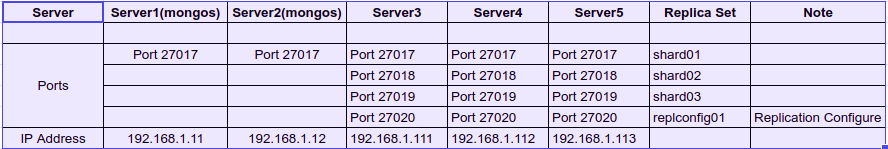

# Table of content

- [1. Requirements](#requirements)
- [2. Installing MongoDB](#installing-mongodb)
- [3. Setup Config Server](#config-server)
- [4. Setup Shards](#setup-shards)
- [5. Setup Query Router - mongos](#setup-mongos)
- [6. Adding a new Query Router - mongos](#add-new-mongos)
- [7. Deploy Sharded Cluster with Authentication](#shard-cluster-with-authentication)

==========================================================

## <a name="requirements">1. Requirements</a>

- Mô hình hệ thống

<p align="center">

</p>

- Quy hoạch IP và port

<p align="center">

</p>

- Thêm thông tin sau vào /etc/hosts

192.168.1.111    mongo-config-1
192.168.1.112    mongo-config-2
192.168.1.113    mongo-config-3
192.168.1.11    mongos01
192.168.1.12    mongos02

- Setup max number of open file descriptors

```
cat >>/etc/security/limits.conf <<EOF
root soft nofile 65535
root hard nofile 65535
* soft nofile 65535
* hard nofile 65535
#max number of processes
* - nproc 102400
* - nofile 102400
* - core unlimited
EOF

cat >>/etc/security/limits.d/20-nproc.conf<<EOF
*          soft    nproc     unlimited
EOF
```

- Disable Selinux

```
sed -i 's/SELINUX=enforcing/SELINUX=disabled/g' /etc/selinux/config
setenforce 0
```

## <a name="installing-mongodb">2. Installing MongoDB</a>

Thực hiện các bước sau trên các servers

- Create repo

```
cat >/etc/yum.repos.d/mongodb.repo<<EOF
[MongoDB]
name=MongoDB Repository
baseurl=http://repo.mongodb.org/yum/redhat/\$releasever/mongodb-org/4.0/x86_64/
gpgcheck=0
enabled=1
EOF
```

- Install

`yum install mongodb-org -y`

## <a name="config-server">3. Setup Config Server</a>

Thực hiện cấu hình các bước sau trên các Config server

**Step1**: Tạo thư mục chứa data cho config server, shards

```
mkdir -p /data/config
mkdir -p /data/shard1
mkdir -p /data/shard2
mkdir -p /data/shard3
chown -R mongod. /data
```

**Step2**: Tạo tệp cấu hình /etc/mongod-config.conf

```
systemLog:
  destination: file
  logAppend: true
  path: /var/log/mongodb/mongod.log

storage:
  dbPath: /data/config
  journal:
    enabled: true

processManagement:
  fork: true  # fork and run in background
  pidFilePath: /var/run/mongodb/mongod-config.pid  # location of pidfile
  timeZoneInfo: /usr/share/zoneinfo

net:
  port: 27020
  bindIp: 0.0.0.0  # Enter 0.0.0.0,:: to bind to all IPv4 and IPv6 addresses or, alternatively, use the net.bindIpAll setting.

replication:
   replSetName: "replconfig01"

sharding:
   clusterRole: configsvr
```

**Step3**: Start mongodb configsrv

`mongod --config /etc/mongod-config.conf`


**Step4**: Configure replication on configsvr

Sau khi run các config server, chúng ta thực hiện khởi tạo replication trên một instance của config server

```
mongo --host localhost --port 27020
rs.initiate(
  {
    _id: "replconfig01",
    configsvr: true,
    members: [
      { _id : 0, host : "mongo-config-1:27020" },
      { _id : 1, host : "mongo-config-2:27020" },
      { _id : 2, host : "mongo-config-3:27020" }
    ]
  }
)
```

**Note**: Chúng ta khởi tạo replica set con config server với tham số cấu hình `configsvr: true`

## <a name="setup-shards">4. Setup Shard</a>

Thực hiện cấu hình các bước sau trên shard server

Ở đây, trên mỗi server chúng ta tạo 03 instance cho mongod với các port 27017,27018,27019 tương ứng cho các shard1, shard2, shard3. Nghĩa là, chúng tạo 03 shard, với mỗi shard là một `replica set` của 3 instance. Vì thế chúng ta sẽ tạo 09 instance cho mongod service

Trên mỗi server, chúng ta thực hiện các bước sau để cấu hình các shard

**Step1**: Cấu hình cho shard1

- Tạo các tệp cấu hình /etc/mongo-shard1.conf

```
systemLog:
  destination: file
  logAppend: true
  logRotate: reopen
  path: /var/log/mongodb/shard1.log

storage:
  dbPath: /data/shard1
  journal:
    enabled: true

processManagement:
  fork: true  # fork and run in background
  pidFilePath: /var/run/mongodb/mongod-shard1.pid  # location of pidfile
  timeZoneInfo: /usr/share/zoneinfo

net:
  port: 27017
  bindIp: 0.0.0.0  # Enter 0.0.0.0,:: to bind to all IPv4 and IPv6 addresses or, alternatively, use the net.bindIpAll setting.

replication:
   replSetName: "shard01"

sharding:
   clusterRole: shardsvr
```

Trong tệp cấu hình này, chúng đặt tên cho replication là “shard01” và clusterRole cho sharding là “shardsvr”.

Tương tự như vậy, chúng ta tạo tệp cấu hình cho shard2 và shard3

- Tạo các tệp cấu hình /etc/mongo-shard2.conf

```
systemLog:
  destination: file
  logAppend: true
  logRotate: reopen
  path: /var/log/mongodb/shard2.log

storage:
  dbPath: /data/shard2
  journal:
    enabled: true

processManagement:
  fork: true  # fork and run in background
  pidFilePath: /var/run/mongodb/mongod-shard2.pid  # location of pidfile
  timeZoneInfo: /usr/share/zoneinfo

net:
  port: 27018
  bindIp: 0.0.0.0  # Enter 0.0.0.0,:: to bind to all IPv4 and IPv6 addresses or, alternatively, use the net.bindIpAll setting.

replication:
   replSetName: "shard02"

sharding:
   clusterRole: shardsvr
```

- Tạo các tệp cấu hình /etc/mongo-shard3.conf

```
systemLog:
  destination: file
  logAppend: true
  logRotate: reopen
  path: /var/log/mongodb/shard3.log

storage:
  dbPath: /data/shard3
  journal:
    enabled: true

processManagement:
  fork: true  # fork and run in background
  pidFilePath: /var/run/mongodb/mongod-shard3.pid  # location of pidfile
  timeZoneInfo: /usr/share/zoneinfo

net:
  port: 27019
  bindIp: 0.0.0.0  # Enter 0.0.0.0,:: to bind to all IPv4 and IPv6 addresses or, alternatively, use the net.bindIpAll setting.

replication:
   replSetName: "shard03"

sharding:
   clusterRole: shardsvr
```


**Step2**: Start các mongod service

Thực hiện start các instance mongod service trên các server3, server4, server5

```
mongod --config /etc/mongo-shard1.conf
mongod --config /etc/mongo-shard2.conf
mongod --config /etc/mongo-shard3.conf
```

**Step3**: Cấu hình replica set cho các shard

Trên mỗi replica set, chúng ta sẽ ưu tiên trên mỗi server chỉ chỉ set một vai trò master trên đó để đảm bảo việc read/write dữ liệu vào các server cân bằng hơn.

- Cấu hình replica set cho shard1

Thực hiện truy cập mongo shard và khởi tạo replica set `shard1` trên server3

```
mongo --host localhost --port 27017
rs.initiate(
  {
    _id: "shard01",
    members: [
      { _id : 0, host : "mongo-config-1:27017", priority: 2 },
      { _id : 1, host : "mongo-config-2:27017", priority: 1 },
      { _id : 2, host : "mongo-config-3:27017", priority: 0 }
    ]
  }
)
```

- Cấu hình replica set cho shard2

Thực hiện truy cập mongo shard và khởi tạo replica set `shard2` trên server4

```
mongo --host localhost --port 27018
rs.initiate(
  {
    _id: "shard02",
    members: [
      { _id : 0, host : "mongo-config-2:27018", priority: 2 },
      { _id : 1, host : "mongo-config-3:27018", priority: 1 },
      { _id : 2, host : "mongo-config-1:27018", priority: 0 }
    ]
  }
)
```

- Cấu hình replica set cho shard3

Thực hiện truy cập mongo shard và khởi tạo replica set `shard3` trên server5

```
mongo --host localhost --port 27019
rs.initiate(
  {
    _id: "shard03",
    members: [
      { _id : 0, host : "mongo-config-3:27019", priority: 2 },
      { _id : 1, host : "mongo-config-1:27019", priority: 1 },
      { _id : 2, host : "mongo-config-2:27019", priority: 0 }
    ]
  }
)
```

**Step4**: Check shard trên mỗi server

```
[root@node01 ~]# mongo -port 27017
MongoDB shell version v4.0.23
connecting to: mongodb://127.0.0.1:27017/?gssapiServiceName=mongodb
Implicit session: session { "id" : UUID("ced31d75-f290-40dd-a54c-0c584b8e7d96") }
MongoDB server version: 4.0.23
shard01:PRIMARY> 


[root@node02 ~]# mongo --port 27018
MongoDB shell version v4.0.23
connecting to: mongodb://127.0.0.1:27018/?gssapiServiceName=mongodb
Implicit session: session { "id" : UUID("6b942cd1-207f-4dc7-9ef3-526f56808a9e") }
MongoDB server version: 4.0.23
shard02:PRIMARY> 

[root@node03 ~]# mongo --port 27019
MongoDB shell version v4.0.23
connecting to: mongodb://127.0.0.1:27019/?gssapiServiceName=mongodb
Implicit session: session { "id" : UUID("068a5068-57b0-4f38-9ea3-3fbbfdbc24b0") }
MongoDB server version: 4.0.23
shard03:PRIMARY> 
```

## <a name="setup-mongos">5. Setup Query Router - mongos</a>

Phần này, chúng ta thực hiện cấu hình trên mongos instance đầu tiên.

**Step1**: Tệp tệp cấu hình /etc/mongod.conf

```
systemLog:
  destination: file
  logAppend: true
  path: /var/log/mongodb/mongos.log

processManagement:
  fork: true  # fork and run in background
  pidFilePath: /var/run/mongodb/mongod.pid  # location of pidfile
  timeZoneInfo: /usr/share/zoneinfo

net:
  port: 27017
  bindIp: 0.0.0.0  # Enter 0.0.0.0,:: to bind to all IPv4 and IPv6 addresses or, alternatively, use the net.bindIpAll setting.

sharding:
  configDB: "replconfig01/mongo-config-1:27020,mongo-config-2:27020,mongo-config-3:27020"
```

**Step2**: Start mongos

`mongos -f /etc/mongod.conf`

Nếu chạy mongos như systemd, khi đó tạo tệp tin /usr/lib/systemd/system/mongos.service

```
[Unit]
Description=MongoDB Database Service
Wants=network.target
After=network.target

[Service]
User=mongod
Group=mongod
Type=simple
Environment="OPTIONS=--config /etc/mongod.conf"
ExecStart=/usr/bin/mongos $OPTIONS
ExecStartPre=/usr/bin/mkdir -p /var/run/mongodb
ExecStartPre=/usr/bin/chown mongod:mongod /var/run/mongodb
ExecStartPre=/usr/bin/chmod 0755 /var/run/mongodb
ExecReload=/bin/kill -HUP $MAINPID
PermissionsStartOnly=true
PIDFile=/var/run/mongodb/mongod.pid
Restart=always
Type=forking

User=mongod
Group=mongod
[Install]
WantedBy=multi-user.target
```

- Start mongos service

```
systemctl daemon-reload
systemctl start mongos
```

**Step3**: Add shards to mongos/Query Router

Ở đây chúng ta có 03 shards với cấu hình replica set (shard01, shard02, shard03).

Login mongos

`mongo --host mongos --port 27017`

và thực hiện thêm các shard đến mongos như sau:

```
sh.addShard( "shard01/mongo-config-1:27017")
sh.addShard( "shard01/mongo-config-2:27017")
sh.addShard( "shard01/mongo-config-3:27017")

sh.addShard( "shard02/mongo-config-1:27018")
sh.addShard( "shard02/mongo-config-2:27018")
sh.addShard( "shard02/mongo-config-3:27018")

sh.addShard( "shard03/mongo-config-1:27019")
sh.addShard( "shard03/mongo-config-2:27019")
sh.addShard( "shard03/mongo-config-3:27019")
```

mongos> sh.addShard( "shard01/mongo-config-1:27017")
{
	"shardAdded" : "shard01",
	"ok" : 1,
	"operationTime" : Timestamp(1618755541, 6),
	"$clusterTime" : {
		"clusterTime" : Timestamp(1618755541, 6),
		"signature" : {
			"hash" : BinData(0,"AAAAAAAAAAAAAAAAAAAAAAAAAAA="),
			"keyId" : NumberLong(0)
		}
	}
}
mongos> sh.addShard( "shard01/mongo-config-2:27017")
{
	"shardAdded" : "shard01",
	"ok" : 1,
	"operationTime" : Timestamp(1618755541, 6),
	"$clusterTime" : {
		"clusterTime" : Timestamp(1618755541, 6),
		"signature" : {
			"hash" : BinData(0,"AAAAAAAAAAAAAAAAAAAAAAAAAAA="),
			"keyId" : NumberLong(0)
		}
	}
}
mongos> sh.addShard( "shard01/mongo-config-3:27017")
{
	"shardAdded" : "shard01",
	"ok" : 1,
	"operationTime" : Timestamp(1618755541, 6),
	"$clusterTime" : {
		"clusterTime" : Timestamp(1618755541, 6),
		"signature" : {
			"hash" : BinData(0,"AAAAAAAAAAAAAAAAAAAAAAAAAAA="),
			"keyId" : NumberLong(0)
		}
	}
}
mongos> 
mongos> sh.addShard( "shard02/mongo-config-1:27018")
{
	"shardAdded" : "shard02",
	"ok" : 1,
	"operationTime" : Timestamp(1618755541, 11),
	"$clusterTime" : {
		"clusterTime" : Timestamp(1618755541, 11),
		"signature" : {
			"hash" : BinData(0,"AAAAAAAAAAAAAAAAAAAAAAAAAAA="),
			"keyId" : NumberLong(0)
		}
	}
}
mongos> sh.addShard( "shard02/mongo-config-2:27018")
{
	"shardAdded" : "shard02",
	"ok" : 1,
	"operationTime" : Timestamp(1618755541, 11),
	"$clusterTime" : {
		"clusterTime" : Timestamp(1618755541, 11),
		"signature" : {
			"hash" : BinData(0,"AAAAAAAAAAAAAAAAAAAAAAAAAAA="),
			"keyId" : NumberLong(0)
		}
	}
}
mongos> sh.addShard( "shard02/mongo-config-3:27018")
{
	"shardAdded" : "shard02",
	"ok" : 1,
	"operationTime" : Timestamp(1618755541, 11),
	"$clusterTime" : {
		"clusterTime" : Timestamp(1618755541, 11),
		"signature" : {
			"hash" : BinData(0,"AAAAAAAAAAAAAAAAAAAAAAAAAAA="),
			"keyId" : NumberLong(0)
		}
	}
}
mongos> 
mongos> sh.addShard( "shard03/mongo-config-1:27019")
{
	"shardAdded" : "shard03",
	"ok" : 1,
	"operationTime" : Timestamp(1618755541, 15),
	"$clusterTime" : {
		"clusterTime" : Timestamp(1618755541, 15),
		"signature" : {
			"hash" : BinData(0,"AAAAAAAAAAAAAAAAAAAAAAAAAAA="),
			"keyId" : NumberLong(0)
		}
	}
}
mongos> sh.addShard( "shard03/mongo-config-2:27019")
{
	"shardAdded" : "shard03",
	"ok" : 1,
	"operationTime" : Timestamp(1618755541, 15),
	"$clusterTime" : {
		"clusterTime" : Timestamp(1618755541, 15),
		"signature" : {
			"hash" : BinData(0,"AAAAAAAAAAAAAAAAAAAAAAAAAAA="),
			"keyId" : NumberLong(0)
		}
	}
}
mongos> sh.addShard( "shard03/mongo-config-3:27019")
{
	"shardAdded" : "shard03",
	"ok" : 1,
	"operationTime" : Timestamp(1618755541, 15),
	"$clusterTime" : {
		"clusterTime" : Timestamp(1618755541, 15),
		"signature" : {
			"hash" : BinData(0,"AAAAAAAAAAAAAAAAAAAAAAAAAAA="),
			"keyId" : NumberLong(0)
		}
	}
}
mongos> 


- Check shard status

```
mongos> sh.status()
--- Sharding Status --- 
  sharding version: {
  	"_id" : 1,
  	"minCompatibleVersion" : 5,
  	"currentVersion" : 6,
  	"clusterId" : ObjectId("6077fa4c673f0ec1ec4ba9d1")
  }
  shards:
        {  "_id" : "shard01",  "host" : "shard01/mongo-config-1:27017,mongo-config-2:27017,mongo-config-3:27017",  "state" : 1 }
        {  "_id" : "shard02",  "host" : "shard02/mongo-config-1:27018,mongo-config-2:27018,mongo-config-3:27018",  "state" : 1 }
        {  "_id" : "shard03",  "host" : "shard03/mongo-config-1:27019,mongo-config-2:27019,mongo-config-3:27019",  "state" : 1 }
  active mongoses:
        "4.0.24" : 1
  autosplit:
        Currently enabled: yes
  balancer:
        Currently enabled:  yes
        Currently running:  no
        Failed balancer rounds in last 5 attempts:  0
        Migration Results for the last 24 hours: 
                No recent migrations
  databases:
        {  "_id" : "config",  "primary" : "config",  "partitioned" : true }

mongos> 
```
Ở đây, chúng ta có thể thấy một số thông tin như thông tin các instance của các shard, trạng thái shard

**Step4**: Enable Sharding at Database Level

Chúng ta thử enable sharding cho một database mới

```
mongo --host 192.168.1.11 --port 27017
mongos> use example
switched to db example
mongos> sh.enableSharding("example")
{
	"ok" : 1,
	"operationTime" : Timestamp(1618940724, 4),
	"$clusterTime" : {
		"clusterTime" : Timestamp(1618940724, 4),
		"signature" : {
			"hash" : BinData(0,"AAAAAAAAAAAAAAAAAAAAAAAAAAA="),
			"keyId" : NumberLong(0)
		}
	}
}
mongos>
```

**Step5**: Enable Sharding at Collection Level

ở bước trên chúng ta đã enable shard cho database. Bước này chúng ta sẽ enable sharding cho một collection.

Để thực hiện sharding cho collection, chúng ta cần xác định sẽ partition theo `range based` hay `hash based` (Mặc định sharding theo `range based`).

Trong phần này chúng ta sẽ shard theo `hash based` để nhìn rõ hơn quá trình phân vùng dữ liệu qua các shard.

```
mongo --host 192.168.1.11 --port 27017
mongos> use example
mongos> db.exCollection.ensureIndex({ _id : "hashed" })
mongos> sh.shardCollection("example.exCollection", {"_id" : "hashed"})
mongos>
```

Ở đây, Chúng ta tạo collection `exCollection` trong `example` database và cần thực hiện tạo index cho trường `_id` với kiểu `hashed`. Trường `_id` mặc định được tạo và đánh index với `unique index`

**Step6**: Check sharding status

```
mongos> sh.status()
--- Sharding Status --- 
  sharding version: {
  	"_id" : 1,
  	"minCompatibleVersion" : 5,
  	"currentVersion" : 6,
  	"clusterId" : ObjectId("6077fa4c673f0ec1ec4ba9d1")
  }
  shards:
        {  "_id" : "shard01",  "host" : "shard01/mongo-config-1:27017,mongo-config-2:27017,mongo-config-3:27017",  "state" : 1 }
        {  "_id" : "shard02",  "host" : "shard02/mongo-config-1:27018,mongo-config-2:27018,mongo-config-3:27018",  "state" : 1 }
        {  "_id" : "shard03",  "host" : "shard03/mongo-config-1:27019,mongo-config-2:27019,mongo-config-3:27019",  "state" : 1 }
  active mongoses:
        "4.0.24" : 1
  autosplit:
        Currently enabled: yes
  balancer:
        Currently enabled:  yes
        Currently running:  no
        Failed balancer rounds in last 5 attempts:  0
        Migration Results for the last 24 hours: 
                No recent migrations
  databases:
        {  "_id" : "config",  "primary" : "config",  "partitioned" : true }
                config.system.sessions
                        shard key: { "_id" : 1 }
                        unique: false
                        balancing: true
                        chunks:
                                shard01	342
                                shard02	341
                                shard03	341
                        too many chunks to print, use verbose if you want to force print
        {  "_id" : "example",  "primary" : "shard02",  "partitioned" : true,  "version" : {  "uuid" : UUID("17b43459-bb00-461a-816b-83143bdb101f"),  "lastMod" : 1 } }
                example.exCollection
                        shard key: { "_id" : "hashed" }
                        unique: false
                        balancing: true
                        chunks:
                                shard01	2
                                shard02	2
                                shard03	2
                        { "_id" : { "$minKey" : 1 } } -->> { "_id" : NumberLong("-6148914691236517204") } on : shard01 Timestamp(1, 0) 
                        { "_id" : NumberLong("-6148914691236517204") } -->> { "_id" : NumberLong("-3074457345618258602") } on : shard01 Timestamp(1, 1) 
                        { "_id" : NumberLong("-3074457345618258602") } -->> { "_id" : NumberLong(0) } on : shard02 Timestamp(1, 2) 
                        { "_id" : NumberLong(0) } -->> { "_id" : NumberLong("3074457345618258602") } on : shard02 Timestamp(1, 3) 
                        { "_id" : NumberLong("3074457345618258602") } -->> { "_id" : NumberLong("6148914691236517204") } on : shard03 Timestamp(1, 4) 
                        { "_id" : NumberLong("6148914691236517204") } -->> { "_id" : { "$maxKey" : 1 } } on : shard03 Timestamp(1, 5) 

mongos> 

```

**Step7**: Insert data và kiểm tra quá trình partition

Từ client thực hiện insert dữ liệu qua mongos

```
mongos>use example
mongos> for (var i = 1; i <= 10000; i++) db.exCollection.insert( { x : i } )
WriteResult({ "nInserted" : 1 })
mongos> 
```

Khi đó check dữ liệu phân tán ở các shard như nào

```
mongos> use example
mongos> db.exCollection.getShardDistribution()

Shard shard03 at shard03/mongo-config-1:27019,mongo-config-2:27019,mongo-config-3:27019
 data : 108KiB docs : 3364 chunks : 2
 estimated data per chunk : 54KiB
 estimated docs per chunk : 1682

Shard shard01 at shard01/mongo-config-1:27017,mongo-config-2:27017,mongo-config-3:27017
 data : 105KiB docs : 3263 chunks : 2
 estimated data per chunk : 52KiB
 estimated docs per chunk : 1631

Shard shard02 at shard02/mongo-config-1:27018,mongo-config-2:27018,mongo-config-3:27018
 data : 108KiB docs : 3373 chunks : 2
 estimated data per chunk : 54KiB
 estimated docs per chunk : 1686

Totals
 data : 322KiB docs : 10000 chunks : 6
 Shard shard03 contains 33.63% data, 33.63% docs in cluster, avg obj size on shard : 33B
 Shard shard01 contains 32.63% data, 32.63% docs in cluster, avg obj size on shard : 33B
 Shard shard02 contains 33.73% data, 33.73% docs in cluster, avg obj size on shard : 33B

mongos> 
```

## <a name="add-new-mongos">6. Adding a new Query Router - mongos</a>

Để hệ thống có high availability & scalability, chúng ta cần triển khai thêm mongos instance.

Về phương pháp triển khai thêm mongos instance, chúng ta chỉ cần cài đặt mongos chạy như mongos instance đầu tiên. Thông tin shard cluster nó sẽ nhận từ các Config Server.

**Step1**: Tệp tệp cấu hình /etc/mongod.conf

```
systemLog:
  destination: file
  logAppend: true
  path: /var/log/mongodb/mongos.log

processManagement:
  fork: true  # fork and run in background
  pidFilePath: /var/run/mongodb/mongod.pid  # location of pidfile
  timeZoneInfo: /usr/share/zoneinfo

net:
  port: 27017
  bindIp: 0.0.0.0  # Enter 0.0.0.0,:: to bind to all IPv4 and IPv6 addresses or, alternatively, use the net.bindIpAll setting.

sharding:
  configDB: "replconfig01/mongo-config-1:27020,mongo-config-2:27020,mongo-config-3:27020"
```

**Step2**: Start mongos

`mongos -f /etc/mongod.conf`

Nếu chạy mongos như systemd, khi đó tạo tệp tin /usr/lib/systemd/system/mongos.service

```
[Unit]
Description=MongoDB Database Service
Wants=network.target
After=network.target

[Service]
User=mongod
Group=mongod
Type=simple
Environment="OPTIONS=--config /etc/mongod.conf"
ExecStart=/usr/bin/mongos $OPTIONS
ExecStartPre=/usr/bin/mkdir -p /var/run/mongodb
ExecStartPre=/usr/bin/chown mongod:mongod /var/run/mongodb
ExecStartPre=/usr/bin/chmod 0755 /var/run/mongodb
ExecReload=/bin/kill -HUP $MAINPID
PermissionsStartOnly=true
PIDFile=/var/run/mongodb/mongod.pid
Restart=always
Type=forking

User=mongod
Group=mongod
[Install]
WantedBy=multi-user.target
```

- Start mongos service

```
systemctl daemon-reload
systemctl start mongos
```

**Step3**: Check shard status

- Login mongos

```
[root@mongos02 ~]# mongo --host 192.168.1.12 --port 27017
MongoDB shell version v4.0.24
connecting to: mongodb://192.168.1.12:27017/?gssapiServiceName=mongodb
Implicit session: session { "id" : UUID("e415c22d-b605-4571-8cfa-c45c0d891852") }
MongoDB server version: 4.0.24
Server has startup warnings: 
2021-04-21T17:54:15.437+0000 I CONTROL  [main] 
2021-04-21T17:54:15.437+0000 I CONTROL  [main] ** WARNING: Access control is not enabled for the database.
2021-04-21T17:54:15.437+0000 I CONTROL  [main] **          Read and write access to data and configuration is unrestricted.
2021-04-21T17:54:15.437+0000 I CONTROL  [main] 
mongos> 
```

- Check shard status

```
mongos> sh.status()
--- Sharding Status --- 
  sharding version: {
  	"_id" : 1,
  	"minCompatibleVersion" : 5,
  	"currentVersion" : 6,
  	"clusterId" : ObjectId("6077fa4c673f0ec1ec4ba9d1")
  }
  shards:
        {  "_id" : "shard01",  "host" : "shard01/mongo-config-1:27017,mongo-config-2:27017,mongo-config-3:27017",  "state" : 1 }
        {  "_id" : "shard02",  "host" : "shard02/mongo-config-1:27018,mongo-config-2:27018,mongo-config-3:27018",  "state" : 1 }
        {  "_id" : "shard03",  "host" : "shard03/mongo-config-1:27019,mongo-config-2:27019,mongo-config-3:27019",  "state" : 1 }
  active mongoses:
        "4.0.24" : 2
  autosplit:
        Currently enabled: yes
  balancer:
        Currently enabled:  yes
        Currently running:  no
        Failed balancer rounds in last 5 attempts:  0
        Migration Results for the last 24 hours: 
                No recent migrations
  databases:
        {  "_id" : "config",  "primary" : "config",  "partitioned" : true }
                config.system.sessions
                        shard key: { "_id" : 1 }
                        unique: false
                        balancing: true
                        chunks:
                                shard01	342
                                shard02	341
                                shard03	341
                        too many chunks to print, use verbose if you want to force print
        {  "_id" : "example",  "primary" : "shard02",  "partitioned" : true,  "version" : {  "uuid" : UUID("17b43459-bb00-461a-816b-83143bdb101f"),  "lastMod" : 1 } }
                example.exCollection
                        shard key: { "_id" : "hashed" }
                        unique: false
                        balancing: true
                        chunks:
                                shard01	2
                                shard02	2
                                shard03	2
                        { "_id" : { "$minKey" : 1 } } -->> { "_id" : NumberLong("-6148914691236517204") } on : shard01 Timestamp(1, 0) 
                        { "_id" : NumberLong("-6148914691236517204") } -->> { "_id" : NumberLong("-3074457345618258602") } on : shard01 Timestamp(1, 1) 
                        { "_id" : NumberLong("-3074457345618258602") } -->> { "_id" : NumberLong(0) } on : shard02 Timestamp(1, 2) 
                        { "_id" : NumberLong(0) } -->> { "_id" : NumberLong("3074457345618258602") } on : shard02 Timestamp(1, 3) 
                        { "_id" : NumberLong("3074457345618258602") } -->> { "_id" : NumberLong("6148914691236517204") } on : shard03 Timestamp(1, 4) 
                        { "_id" : NumberLong("6148914691236517204") } -->> { "_id" : { "$maxKey" : 1 } } on : shard03 Timestamp(1, 5) 

mongos> 
```

**Step4**: Check high avaibility and scalability

- **Check high avaibility**

Chúng ta thực hiện stop mongos đầu tiên (192.168.1.11) và check hoạt động của mongos thứ 2 (192.168.1.12)

```
[root@mongos01 ~]# systemctl status mongos
● mongos.service - MongoDB Database Service
   Loaded: loaded (/usr/lib/systemd/system/mongos.service; enabled; vendor preset: disabled)
   Active: inactive (dead) since Sat 2021-04-24 18:07:23 UTC; 3s ago
  Process: 4082 ExecStart=/usr/bin/mongos $OPTIONS (code=exited, status=0/SUCCESS)
  Process: 4079 ExecStartPre=/usr/bin/chmod 0755 /var/run/mongodb (code=exited, status=0/SUCCESS)
  Process: 4076 ExecStartPre=/usr/bin/chown mongod:mongod /var/run/mongodb (code=exited, status=0/SUCCESS)
  Process: 4075 ExecStartPre=/usr/bin/mkdir -p /var/run/mongodb (code=exited, status=0/SUCCESS)
 Main PID: 4086 (code=exited, status=0/SUCCESS)

Apr 24 18:07:08 mongos01 systemd[1]: Starting MongoDB Database Service...
Apr 24 18:07:08 mongos01 mongos[4082]: about to fork child process, waiting until server is ready for connections.
Apr 24 18:07:08 mongos01 mongos[4082]: forked process: 4086
Apr 24 18:07:10 mongos01 systemd[1]: Started MongoDB Database Service.
Apr 24 18:07:23 mongos01 systemd[1]: Stopping MongoDB Database Service...
Apr 24 18:07:23 mongos01 systemd[1]: Stopped MongoDB Database Service.
[root@mongos01 ~]# 
```

Thực hiện login mongos thứ 2 và enable shard cho example2 database

```
[root@mongos02 ~]# mongo --host 192.168.1.12
MongoDB shell version v4.0.24
connecting to: mongodb://192.168.1.12:27017/?gssapiServiceName=mongodb
Implicit session: session { "id" : UUID("51532669-6c19-4e74-9b90-49f2d83e2705") }
MongoDB server version: 4.0.24
Server has startup warnings: 
2021-04-24T16:49:32.246+0000 I CONTROL  [main] 
2021-04-24T16:49:32.246+0000 I CONTROL  [main] ** WARNING: Access control is not enabled for the database.
2021-04-24T16:49:32.246+0000 I CONTROL  [main] **          Read and write access to data and configuration is unrestricted.
2021-04-24T16:49:32.246+0000 I CONTROL  [main] 
mongos> use example2
switched to db example2
mongos> sh.enableSharding("example2")
{
	"ok" : 1,
	"operationTime" : Timestamp(1619287732, 4),
	"$clusterTime" : {
		"clusterTime" : Timestamp(1619287732, 4),
		"signature" : {
			"hash" : BinData(0,"AAAAAAAAAAAAAAAAAAAAAAAAAAA="),
			"keyId" : NumberLong(0)
		}
	}
}
mongos> db.exCollection.ensureIndex({ _id : "hashed" })
{
	"raw" : {
		"shard02/mongo-config-1:27018,mongo-config-2:27018,mongo-config-3:27018" : {
			"createdCollectionAutomatically" : false,
			"numIndexesBefore" : 1,
			"numIndexesAfter" : 2,
			"ok" : 1
		}
	},
	"ok" : 1,
	"operationTime" : Timestamp(1619287756, 9),
	"$clusterTime" : {
		"clusterTime" : Timestamp(1619287756, 9),
		"signature" : {
			"hash" : BinData(0,"AAAAAAAAAAAAAAAAAAAAAAAAAAA="),
			"keyId" : NumberLong(0)
		}
	}
}
mongos> sh.shardCollection("example2.exCollection", {"_id" : "hashed"})
{
	"collectionsharded" : "example2.exCollection",
	"collectionUUID" : UUID("81df830e-8bf8-4212-92f0-765f66599041"),
	"ok" : 1,
	"operationTime" : Timestamp(1619287776, 40),
	"$clusterTime" : {
		"clusterTime" : Timestamp(1619287776, 40),
		"signature" : {
			"hash" : BinData(0,"AAAAAAAAAAAAAAAAAAAAAAAAAAA="),
			"keyId" : NumberLong(0)
		}
	}
}
mongos> 
```
- **Check scalability**


## <a name="shard-cluster-with-authentication">7. Deploy Sharded Cluster with Authentication</a>

MongoDB hỗ trợ chứng thực giữa các member trong shard cluster với 2 phương thức

- Keyfile

- X.509

Trong phần này chúng sẽ cấu hình chứng thực shard cluster với keyfile và access control.

**Bước 1: Tạo Keyfile**

Nội dung của keyfile giống như chia sẻ mật khẩu chung giữa các member trong shard cluster. Yêu cầu độ dài của key nằm giữa 6-102 ký tự và có thể chứa các ký tự trong tập base64.

Thực hiện tạo keyfile như sau:

```
openssl rand -base64 123 > /var/lib/mongo/keyfile
chmod 400 /var/lib/mongo/keyfile
```

Thực hiện copy keyfile đã tạo ở trên đến các member server trong shard cluster. Cho rằng đường dẫn chứa keyfile mặc định của các member server là /var/lib/mongo/keyfile

**Bước 2: Sửa nội dung tệp cấu hình**

Thêm nội dung sau vào tệp cấu hình của các member server trong shard cluster

```
security:
    authorization: enabled
    keyFile: /var/lib/mongodb/keyfile
```

**Bước 3: Start mongod và mongos**

Thực hiện start các Config Server (Replica set) trước khi start các member server còn lại.

- Start Config Servers

`mongod -f /etc/mongod-config.conf`

- Start các mongod trên các server

```
mongod -f /etc/mongo-shard1.conf
mongod -f /etc/mongo-shard2.conf
mongod -f /etc/mongo-shard3.conf
```

- Start các mongos service

`systemctl start mongos`

**Bước 4: Tạo tài khoản quản trị**

Thực hiện tạo tài khoản quản trị trên Config Server (Thực hiện trên Primary trong replconfig01)

```
mongo --host 192.168.1.111 --port 27020
mongo>db.createUser({user: "admin", pwd: "password", roles:[{role: "root", db: "admin"}]})
```

Thay thông tin admin/password với tài khoản quản trị cần thiết lập

**Bước 5: Check mongo authentication**

Từ client thực hiện login qua mongos

```
mongo --host 192.168.1.11 --authenticationDatabase admin -u admin -p
MongoDB shell version v4.0.24
Enter password: 
connecting to: mongodb://192.168.1.11:27017/?authSource=admin&gssapiServiceName=mongodb
Implicit session: session { "id" : UUID("9f244647-8560-4ea4-939b-222251d3c118") }
MongoDB server version: 4.0.24
mongos> show dbs;
admin     0.000GB
config    0.004GB
example   0.002GB
example2  0.001GB
test      0.000GB
mongos> 
```
